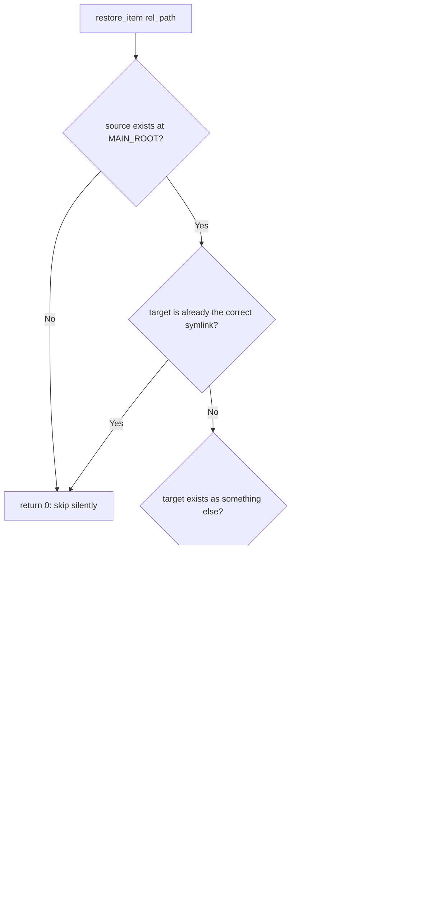
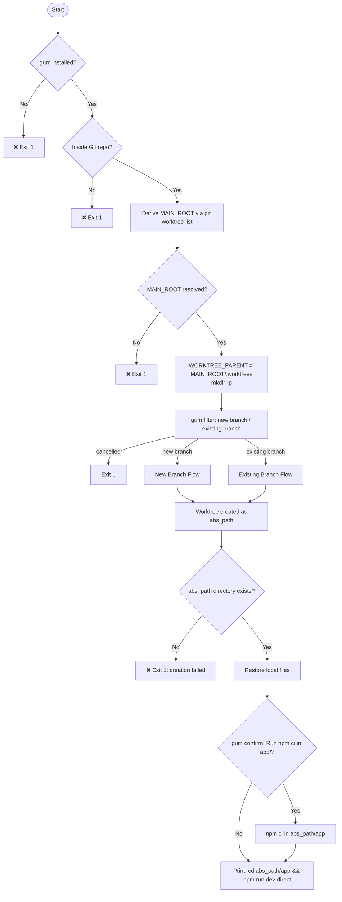
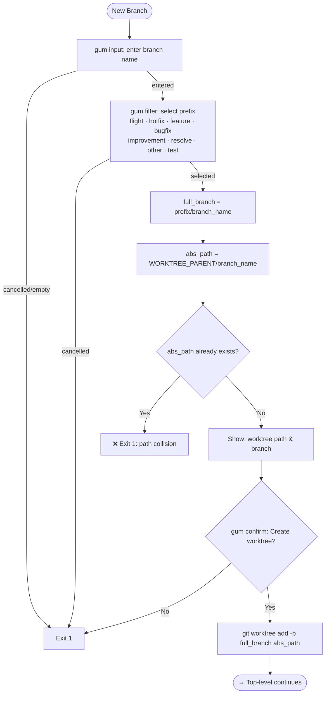
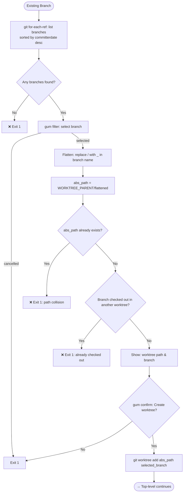

# Spec: `gum_create_worktree.sh`

## Purpose

An interactive shell script that creates a Git worktree for either a new or existing branch, then restores local-only files (env files, certs, design tokens) into the worktree via symlink or copy. Optionally bootstraps the project by running `npm ci`.

---

## Prerequisites

| Requirement | Check | Failure |
|---|---|---|
| `gum` CLI installed | `command -v gum` | Exit 1 |
| Inside a Git repository | `git rev-parse --is-inside-work-tree` | Exit 1 |
| Main worktree root resolvable | `git worktree list --porcelain` | Exit 1 |

---

## Environment Variables

| Variable | Default | Effect |
|---|---|---|
| `RESTORE_MODE` | `symlink` | Set to `copy` to copy files into the worktree rather than symlink them |

---

## Derived Variables

| Variable | Source |
|---|---|
| `MAIN_ROOT` | First entry from `git worktree list --porcelain` — correct even when invoked from inside a worktree |
| `WORKTREE_PARENT` | `"${MAIN_ROOT}/.worktrees"` — subdirectory created inside the main checkout root |

---

## Helper Functions

### `restore_item <rel-path>`

Restores a single file or directory from `MAIN_ROOT` into the new worktree at `abs_path`.

### `restore_glob <pattern>`

Expands a shell glob under `MAIN_ROOT` and calls `restore_item` for each match. Skips non-existent matches silently.

---

## Main Flow

### Top-Level

---

### New Branch Flow

---

### Existing Branch Flow

---

## File Restoration

After worktree creation the following are restored from `MAIN_ROOT`:

| Item | Method |
|---|---|
| `.env` | `restore_item` |
| `.env.local` | `restore_item` |
| `.env.*.local` | `restore_glob` |
| `.env.direct` | `restore_item` |
| `.env.staging` | `restore_item` |
| `.env.production` | `restore_item` |
| `app/.env` | `restore_item` |
| `app/.env.direct` | `restore_item` |
| `dev/certs` | `restore_item` |
| `app/public/design-tokens.source.json` | `restore_item` |

Each item is symlinked by default. Set `RESTORE_MODE=copy` to copy instead.

---

## Guards & Error Handling

| Condition | Message | Exit |
|---|---|---|
| `gum` not installed | `❌ gum is not installed. Exiting.` | 1 |
| Not in a Git repo | `❌ Not inside a Git repository. Exiting.` | 1 |
| MAIN_ROOT unresolvable | `❌ Could not derive main checkout root. Exiting.` | 1 |
| Mode selection cancelled | _(gum cancellation)_ | 1 |
| `abs_path` already exists | `❌ Directory $abs_path already exists. Exiting.` | 1 |
| Branch already checked out | `❌ Branch $branch is already checked out in another worktree. Exiting.` | 1 |
| Worktree dir absent post-create | `❌ Worktree creation failed; skipping restore.` | 1 |
| Ctrl+C at any point | `🚪 Exiting...` | 1 |
| `restore_item` target collision | `[warned] $rel_path — target exists, skipping` | _(continues)_ |
| `npm ci` fails | `⚠️ npm ci exited with an error` | _(continues)_ |

---

## Worktree Path Conventions

| Mode | Path | Branch |
|---|---|---|
| New | `WORKTREE_PARENT/<branch_name>` | `<prefix>/<branch_name>` |
| Existing | `WORKTREE_PARENT/<branch_name_with_/_replaced_by_>` | `<selected_branch>` |

`WORKTREE_PARENT` is `<MAIN_ROOT>/.worktrees`, created automatically. All worktrees are placed inside the main checkout root rather than alongside it.

---

## Exit Codes

| Code | Meaning |
|---|---|
| `0` | Success (or user-cancelled npm ci — script still exits 0) |
| `1` | Guard failure, user cancellation, or creation error |
